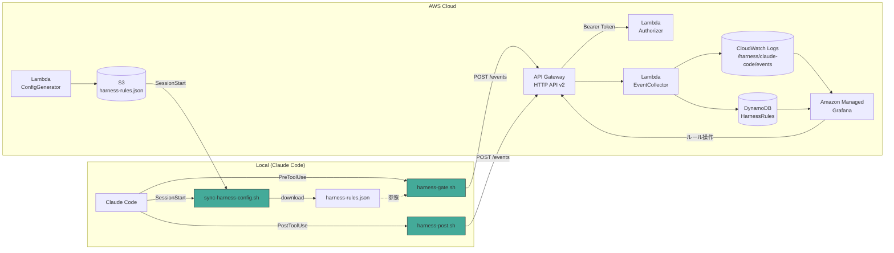
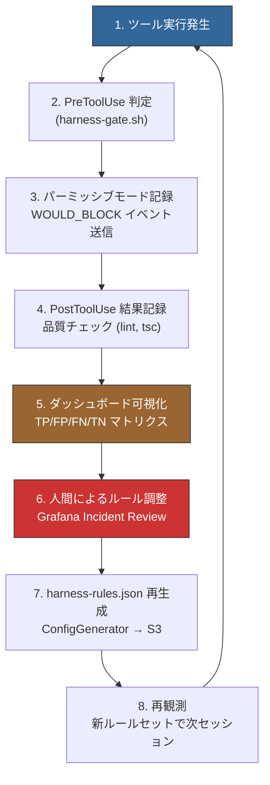

# Harness Cockpit

Claude Code Hooks に SELinux ライクな **permissive → enforcing** モード制御を実装するシステム。全ツール実行をまずブロックせずログに記録し、Grafana ダッシュボードで誤検知パターンを分析した上で、ルール単位でエンフォーシングに昇格させるフィードバックループを提供する。

## アーキテクチャ



## フィードバックループ



## 段階的導入ロードマップ

| Phase | 期間 | 目標 | 状態 |
|-------|------|------|------|
| **Phase 1** | Week 1-2 | 完全パーミッシブ。全操作をログ記録し、行動ベースラインを蓄積 | **実装済み** |
| Phase 2 | Week 3-4 | パーミッシブモードのルール定義。WOULD_BLOCK イベント蓄積開始 | 未着手 |
| Phase 3 | Week 5-8 | FP率10%未満のルールをエンフォーシングに昇格 | 未着手 |
| Phase 4 | Month 3+ | 大半エンフォーシング。新ルール追加時のみパーミッシブで開始 | 未着手 |

## クイックスタート

### 前提条件

- Terraform >= 1.5
- AWS CLI 2.x（プロファイル設定済み）
- jq >= 1.6

### 1. インフラデプロイ

```bash
cd infra/

# APIトークンを生成して設定
echo 'harness_api_token = "'$(uuidgen)'"' > terraform.tfvars

# デプロイ
terraform init && terraform apply
```

### 2. 対象プロジェクトにフックを設置

```bash
HARNESS_REPO="/path/to/harness-cockpit"
TARGET="$(pwd)"

# フックスクリプトをコピー
mkdir -p "${TARGET}/.claude/hooks"
cp "${HARNESS_REPO}/src/hooks/"*.sh "${TARGET}/.claude/hooks/"
chmod +x "${TARGET}/.claude/hooks/"*.sh

# 環境変数を設定（値は terraform output から取得）
cd "${HARNESS_REPO}/infra"
cat > "${TARGET}/.claude/harness-env" << EOF
HARNESS_ENDPOINT=$(terraform output -raw api_endpoint)
HARNESS_TOKEN=$(grep harness_api_token terraform.tfvars | cut -d'"' -f2)
HARNESS_CONFIG_BUCKET=$(terraform output -raw s3_bucket_name)
HARNESS_PROJECT_ID=my-project
EOF

# settings.json にフック登録
cp "${HARNESS_REPO}/config/hooks-settings.json" "${TARGET}/.claude/settings.json"

# .gitignore に追加
echo -e ".claude/harness-env\n.claude/harness-rules.json" >> "${TARGET}/.gitignore"
```

### 3. Grafana ダッシュボードを確認

```bash
cd infra/
terraform output grafana_endpoint
# 表示されたURLにブラウザでアクセス（IAM Identity Center で認証）
# Dashboards > "Harness: Session Timeline" を開く
```

## ディレクトリ構成

```
harness-cockpit/
  infra/                          # Terraform IaC
    main.tf                       #   ルートモジュール
    modules/
      storage/                    #   CloudWatch Logs, DynamoDB, S3, SSM
      lambda/                     #   EventCollector, Authorizer Lambda
      api/                        #   API Gateway HTTP API v2
      grafana/                    #   Amazon Managed Grafana ワークスペース
  src/
    hooks/                        # Claude Code フックスクリプト
      harness-gate.sh             #   PreToolUse: ルール判定 + イベント送信
      harness-post.sh             #   PostToolUse: 品質チェック + イベント送信
      sync-harness-config.sh      #   SessionStart: S3 から設定 pull
    lambda/                       # Lambda 関数コード
      event_collector/            #   イベント受信 → CloudWatch Logs
      authorizer/                 #   Bearer Token 検証
    grafana/                      # Grafana ダッシュボード定義
      session-timeline.json       #   Session Timeline ダッシュボード
  config/                         # 設定テンプレート
    hooks-settings.json           #   Claude Code settings.json テンプレート
    .env.example                  #   環境変数テンプレート
  docs/
    requirements/                 # 設計仕様書
    operations/                   # 運用手順書
```

## 月額コスト

| サービス | 月額 |
|---------|------|
| Amazon Managed Grafana (1 Editor) | $9.00 |
| CloudWatch Logs (取り込み 1GB 想定) | ~$0.76 |
| CloudWatch Logs Insights | ~$0.05 |
| API Gateway HTTP API | ~$0.01 |
| Lambda | Free Tier 内 |
| DynamoDB | Free Tier 内 |
| S3 | ~$0.01 |
| SSM Parameter Store | Free |
| **合計** | **~$10-12** |

## ドキュメント

- [設計仕様書](docs/requirements/00-original-specification.md)
- [インフラデプロイ手順](docs/operations/01-infrastructure-deployment.md)
- [フックインストール手順](docs/operations/02-hook-installation.md)
- [モニタリングとログ分析](docs/operations/03-monitoring-and-log-analysis.md)
- [日常運用](docs/operations/04-daily-operations.md)
- [Grafana セットアップ](docs/operations/05-grafana-setup.md)

## License

[MIT](LICENSE)
