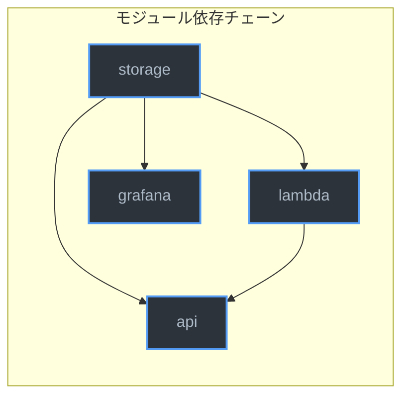

# インフラストラクチャのデプロイ

## 前提条件

以下がインストール済みであること。

| ツール | 最低バージョン | 確認コマンド |
|--------|--------------|-------------|
| Terraform | 1.5+ | `terraform -version` |
| AWS CLI | 2.x | `aws --version` |
| jq | 1.6+ | `jq --version` |

AWS CLIプロファイル `yusuke.sato` が設定済みで、以下の権限を持つこと。

- API Gateway (apigatewayv2:*)
- Lambda (lambda:*)
- CloudWatch Logs (logs:*)
- DynamoDB (dynamodb:*)
- S3 (s3:*)
- SSM Parameter Store (ssm:*)
- IAM (iam:CreateRole, iam:PutRolePolicy, iam:PassRole, iam:GetRole)
- Amazon Managed Grafana (grafana:*)
- IAM Identity Center / AWS SSO (sso:*)

## アーキテクチャ概要

Terraformコードは4つのモジュールで構成される。モジュール間の依存関係は以下のとおり。



- **storage** はすべてのモジュールの基盤。ロググループ、DynamoDB、S3、SSMパラメータを管理する。
- **lambda** は storage が出力するARN・名前に依存し、Lambda関数とIAMロールを管理する。
- **api** は lambda の関数ARN・名前に依存し、API Gatewayリソースを管理する。
- **grafana** は storage のロググループARNに依存し、Grafanaワークスペース・データソース・ダッシュボードを管理する。

## デプロイ手順

### 1. 変数ファイルの作成

```bash
cd infra/
cp -n /dev/null terraform.tfvars
```

`terraform.tfvars` に以下を記述する。このファイルは `.gitignore` 対象のため、リポジトリにコミットされない。

```hcl
harness_api_token     = "<任意のランダム文字列>"
grafana_admin_user_id = "<IAM Identity CenterのユーザーID>"
```

トークンの生成例:

```bash
uuidgen
```

その他の変数はデフォルト値が設定されている。変更する場合のみ `terraform.tfvars` に追記する。

| 変数名 | デフォルト値 | 説明 |
|--------|-------------|------|
| `aws_region` | `ap-northeast-1` | AWSリージョン |
| `aws_profile` | `yusuke.sato` | AWS CLIプロファイル名 |
| `project_id` | `harness-cockpit` | リソース命名に使うプロジェクトID |
| `log_retention_days` | `90` | CloudWatch Logsの保持日数 |
| `grafana_admin_user_id` | なし（必須） | Grafana管理者のIAM Identity CenterユーザーID |

### 2. Terraform初期化

```bash
terraform init
```

初回実行時にプロバイダプラグイン（hashicorp/aws, hashicorp/archive, grafana/grafana）がダウンロードされる。

### 3. プラン確認

```bash
terraform plan
```

作成されるリソース（25個）を確認する。

| モジュール | リソース数 | リソース | 用途 |
|-----------|-----------|---------|------|
| storage | 7 | CloudWatch Logs group | イベントログ格納 |
| | | DynamoDB table | ルール・設定管理（P2で使用） |
| | | S3 bucket | 設定ファイル配信 |
| | | S3 bucket versioning | バケットバージョニング |
| | | S3 bucket public access block | パブリックアクセス遮断 |
| | | SSM Parameter (x2) | モードフラグ、APIトークン |
| lambda | 6 | Lambda function (x2) | EventCollector、Authorizer |
| | | IAM role (x2) | Lambda実行ロール |
| | | IAM role policy (x2) | Lambda実行権限 |
| api | 8 | API Gateway HTTP API | イベント受信エンドポイント |
| | | Stage | デプロイステージ |
| | | Route | APIルーティング |
| | | Integration | Lambda統合 |
| | | Authorizer | Bearer token検証 |
| | | Lambda permission (x2) | API Gateway -> Lambda呼び出し許可 |
| | | CloudWatch Logs group | APIアクセスログ |
| grafana | 4 | IAM role + policy | Grafanaワークスペース実行権限 |
| | | Grafana workspace | Amazon Managed Grafanaワークスペース |
| | | Role association | 管理者ユーザー紐付け |
| | | Workspace API key | Terraformプロビジョニング用APIキー |
| | | CloudWatch data source | CloudWatchデータソース |
| | | Dashboard | Session Timelineダッシュボード |

### 4. デプロイ実行

```bash
terraform apply
```

確認プロンプトで `yes` を入力する。Grafanaワークスペースの作成を含むため、所要時間は数分程度。

完了後、以下のOutputが表示される。

```bash
terraform output
```

| Output名 | 説明 | 取得コマンド |
|-----------|------|-------------|
| `api_endpoint` | API GatewayエンドポイントURL | `terraform output -raw api_endpoint` |
| `log_group_name` | CloudWatch Logsロググループ名 | `terraform output -raw log_group_name` |
| `s3_bucket_name` | 設定配信用S3バケット名 | `terraform output -raw s3_bucket_name` |
| `grafana_endpoint` | Grafanaワークスペース URL | `terraform output -raw grafana_endpoint` |

これらの値は後続の手順（フックインストール、モニタリング設定）で使用する。

### 5. デプロイ検証

APIエンドポイントにテストイベントを送信する。

```bash
ENDPOINT=$(terraform output -raw api_endpoint)
TOKEN=$(grep harness_api_token terraform.tfvars | cut -d'"' -f2)

curl -s -X POST "${ENDPOINT}/events" \
  -H "Authorization: Bearer ${TOKEN}" \
  -H "Content-Type: application/json" \
  -d '{
    "event_type": "pre_tool_use",
    "session_id": "test-001",
    "tool_name": "Bash",
    "tool_input": {"command": "echo hello"},
    "action": "allow",
    "timestamp": "'"$(date -u +%Y-%m-%dT%H:%M:%SZ)"'"
  }'
```

期待される応答:

```json
{"event_id": "evt_xxxxxxxx-xxxx-xxxx-xxxx-xxxxxxxxxxxx"}
```

CloudWatch Logsでイベントを確認する:

```bash
LOG_GROUP=$(terraform output -raw log_group_name)

aws logs filter-log-events \
  --log-group-name "${LOG_GROUP}" \
  --profile yusuke.sato \
  --region ap-northeast-1 \
  --limit 1
```

Grafanaダッシュボードへのアクセスを確認する:

```bash
echo "Grafana URL: $(terraform output -raw grafana_endpoint)"
```

ブラウザでURLにアクセスし、IAM Identity Center認証を経てSession Timelineダッシュボードが表示されることを確認する。

## リソースの撤去

インフラを撤去する場合:

```bash
terraform destroy
```

S3バケットにオブジェクトが存在する場合は先に空にする必要がある。

```bash
BUCKET=$(terraform output -raw s3_bucket_name)
aws s3 rm "s3://${BUCKET}" --recursive --profile yusuke.sato
terraform destroy
```

## Terraform stateの管理

P1ではローカルの `terraform.tfstate` を使用している。このファイルは `.gitignore` 対象だが、紛失するとTerraformがリソースを追跡できなくなるため注意すること。

S3バックエンドへの移行が必要な場合は `backend.tf` を変更し `terraform init -migrate-state` を実行する。
