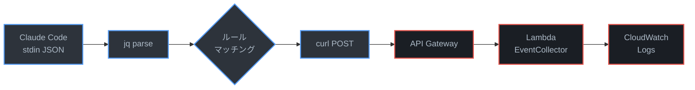
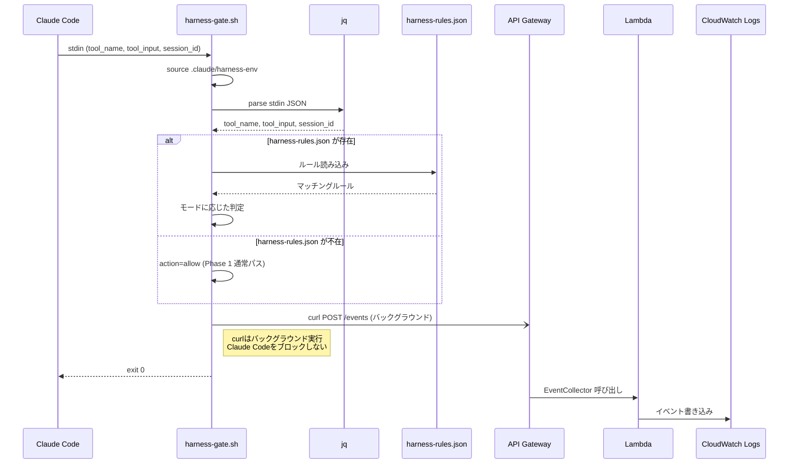
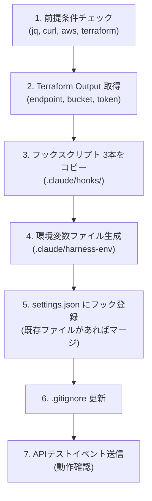

# フックのインストールと設定

対象プロジェクトにHarness Cockpitのフックスクリプトを設置し、Claude Codeのツール実行をログ記録する。

## 概要

設置するフックは3つ。

| フック | トリガー | 役割 |
|--------|---------|------|
| `harness-gate.sh` | PreToolUse (全ツール) | ルール判定とイベント送信。Phase 1では全許可+ログのみ |
| `harness-post.sh` | PostToolUse (Write/Edit/MultiEdit/Bash) | 品質チェック結果の送信 |
| `sync-harness-config.sh` | SessionStart | S3からルール設定をpull |

## データフロー

フックスクリプトがClaude Codeのツール実行イベントを収集し、AWSバックエンドへ送信する全体フローを以下に示す。



### PreToolUseフック実行シーケンス



## インストールスクリプト（推奨）

`scripts/install-hooks.sh` を使用すると、以下の全手順を自動で実行できる。

```bash
# 対象プロジェクトのディレクトリに移動して実行
cd /path/to/target-project
/path/to/harness-cockpit/scripts/install-hooks.sh [PROJECT_ID]
```

PROJECT_ID を省略した場合、ディレクトリ名が使用される。

スクリプトが自動で行う処理:



手動で個別に実行する場合は以下の手順に従う。

---

## 手動手順

### 1. フックスクリプトのコピー

対象プロジェクトのルートで以下を実行する。`HARNESS_REPO` はharness-cockpitリポジトリのパスに置き換える。

```bash
HARNESS_REPO="/path/to/harness-cockpit"
TARGET_PROJECT="$(pwd)"

mkdir -p "${TARGET_PROJECT}/.claude/hooks"

cp "${HARNESS_REPO}/src/hooks/harness-gate.sh"       "${TARGET_PROJECT}/.claude/hooks/"
cp "${HARNESS_REPO}/src/hooks/harness-post.sh"        "${TARGET_PROJECT}/.claude/hooks/"
cp "${HARNESS_REPO}/src/hooks/sync-harness-config.sh" "${TARGET_PROJECT}/.claude/hooks/"

chmod +x "${TARGET_PROJECT}/.claude/hooks/"*.sh
```

### 2. 環境変数ファイルの作成

フックスクリプトは `.claude/harness-env` から環境変数を読み込む。Terraform Outputから値を取得して作成する。

```bash
# harness-cockpitリポジトリのinfra/ディレクトリで実行
cd "${HARNESS_REPO}/infra"

cat > "${TARGET_PROJECT}/.claude/harness-env" << EOF
HARNESS_ENDPOINT=$(terraform output -raw api_endpoint)
HARNESS_TOKEN=$(grep harness_api_token terraform.tfvars | cut -d'"' -f2)
HARNESS_CONFIG_BUCKET=$(terraform output -raw s3_bucket_name)
HARNESS_PROJECT_ID=my-project
EOF
```

各変数の説明:

| 変数 | 値の取得方法 | 説明 |
|------|-------------|------|
| `HARNESS_ENDPOINT` | `terraform output -raw api_endpoint` | API GatewayのエンドポイントURL |
| `HARNESS_TOKEN` | `terraform.tfvars` の `harness_api_token` | Bearer認証トークン |
| `HARNESS_CONFIG_BUCKET` | `terraform output -raw s3_bucket_name` | 設定配信用S3バケット名 |
| `HARNESS_PROJECT_ID` | 任意 | プロジェクト識別子。DynamoDBのPKに使用される |

**注意:** `.claude/harness-env` には認証トークンが含まれるため、対象プロジェクトの `.gitignore` に追加すること。

```bash
echo ".claude/harness-env" >> "${TARGET_PROJECT}/.gitignore"
echo ".claude/harness-rules.json" >> "${TARGET_PROJECT}/.gitignore"
```

### 3. settings.json へのフック登録

対象プロジェクトの `.claude/settings.json` にフック設定を追加する。

既存の `settings.json` がない場合:

```bash
cp "${HARNESS_REPO}/config/hooks-settings.json" "${TARGET_PROJECT}/.claude/settings.json"
```

既存の `settings.json` がある場合は、`hooks` セクションを手動でマージする。`config/hooks-settings.json` の内容を参照し、`PreToolUse`、`PostToolUse`、`SessionStart` の各配列に追記する。

登録されるフック設定の全容:

```json
{
  "hooks": {
    "PreToolUse": [
      {
        "matcher": ".*",
        "hooks": [
          {
            "type": "command",
            "command": "$CLAUDE_PROJECT_DIR/.claude/hooks/harness-gate.sh",
            "timeout": 10
          }
        ]
      }
    ],
    "PostToolUse": [
      {
        "matcher": "Write|Edit|MultiEdit|Bash",
        "hooks": [
          {
            "type": "command",
            "command": "$CLAUDE_PROJECT_DIR/.claude/hooks/harness-post.sh",
            "timeout": 30
          }
        ]
      }
    ],
    "SessionStart": [
      {
        "hooks": [
          {
            "type": "command",
            "command": "$CLAUDE_PROJECT_DIR/.claude/hooks/sync-harness-config.sh"
          }
        ]
      }
    ]
  }
}
```

### 4. 動作確認

フックが正しく動作するか確認する。

#### 4a. harness-gate.sh 単体テスト

```bash
echo '{"tool_name":"Bash","tool_input":{"command":"ls -la"},"session_id":"test-manual"}' \
  | CLAUDE_PROJECT_DIR="${TARGET_PROJECT}" \
    bash "${TARGET_PROJECT}/.claude/hooks/harness-gate.sh"
echo "exit code: $?"
```

期待される結果: exit code 0（何も出力されず、バックグラウンドでイベントが送信される）。

#### 4b. harness-post.sh 単体テスト

```bash
echo '{"tool_name":"Bash","tool_input":{"command":"ls"},"session_id":"test-manual","tool_response":{"exit_code":0}}' \
  | CLAUDE_PROJECT_DIR="${TARGET_PROJECT}" \
    bash "${TARGET_PROJECT}/.claude/hooks/harness-post.sh"
echo "exit code: $?"
```

#### 4c. CloudWatch Logs でイベント確認

数秒待ってからCloudWatch Logsを確認する。

```bash
LOG_GROUP=$(cd "${HARNESS_REPO}/infra" && terraform output -raw log_group_name)

aws logs filter-log-events \
  --log-group-name "${LOG_GROUP}" \
  --profile yusuke.sato \
  --region ap-northeast-1 \
  --filter-pattern '{ $.session_id = "test-manual" }' \
  --limit 5
```

#### 4d. Claude Codeセッションでの統合テスト

対象プロジェクトでClaude Codeを起動し、任意のツールを実行する。その後CloudWatch Logsでセッションのイベントを確認する。

```bash
LOG_GROUP=$(cd "${HARNESS_REPO}/infra" && terraform output -raw log_group_name)

aws logs filter-log-events \
  --log-group-name "${LOG_GROUP}" \
  --profile yusuke.sato \
  --region ap-northeast-1 \
  --start-time $(date -d '10 minutes ago' +%s000) \
  --limit 20
```

## フック動作の詳細

### harness-gate.sh（PreToolUse）

1. `.claude/harness-env` から環境変数を読み込む
2. `HARNESS_ENDPOINT` / `HARNESS_TOKEN` が未設定の場合、即座に exit 0（フック無効化）
3. stdinからJSON（`tool_name`, `tool_input`, `session_id`）を読み取る
4. `.claude/harness-rules.json` の存在を確認
   - 不在: イベントを送信して exit 0（Phase 1の通常パス）
   - 存在: ルールマッチングを実行し、モードに応じて判定（Phase 2+）
5. curlはバックグラウンド実行（`&`）でAPI通信のレイテンシを回避
6. `--max-time 5` でcurlのタイムアウトを制限

### harness-post.sh（PostToolUse）

1. 環境変数読み込み（同上）
2. stdinからJSON読み取り
3. ツール種別に応じた品質チェック:
   - **Write/Edit/MultiEdit**: `biome check`（存在時）、`tsc --noEmit`（.ts/.tsxファイルかつtsconfig.json存在時）
   - **Bash**: `tool_response.exit_code` の確認
4. outcome判定: `success` / `quality_issue` / `execution_failure`
5. イベント送信（バックグラウンド）

### sync-harness-config.sh（SessionStart）

1. 環境変数読み込み
2. S3から `harness-rules.json` をダウンロード
3. ファイルが存在しない場合は静かに失敗（Phase 1では正常）

## 複数プロジェクトへの展開

`HARNESS_PROJECT_ID` をプロジェクトごとに変えることで、単一のAWSインフラで複数プロジェクトを管理できる。CloudWatch Logsでは `project_id` フィールドでフィルタリングする。

```
# プロジェクトA
HARNESS_PROJECT_ID=project-a

# プロジェクトB
HARNESS_PROJECT_ID=project-b
```

## トラブルシューティング

### フックが動作しない

1. スクリプトに実行権限があるか確認: `ls -la .claude/hooks/`
2. `.claude/harness-env` が存在し、変数が正しいか確認
3. `jq` がインストールされているか確認: `which jq`
4. 手動でスクリプトを実行し、エラー出力を確認

### イベントがCloudWatch Logsに記録されない

1. APIエンドポイントに直接curlでテストイベントを送信してみる
2. 認証トークンが正しいか確認
3. Lambda関数のCloudWatch Logsを確認: `/aws/lambda/harness-cockpit-event-collector`
4. API Gatewayのアクセスログを確認: `/aws/apigateway/harness-cockpit-api`

### フックがClaude Codeの動作を遅延させる

フックスクリプトのcurlはバックグラウンド実行のため、通常はClaude Codeの操作をブロックしない。遅延が発生する場合:

1. `jq` によるJSON処理が遅い可能性がある。`harness-rules.json` のサイズを確認
2. PreToolUseのtimeout（10秒）を超過していないかClaude Codeのログを確認
