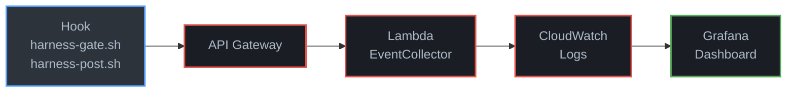
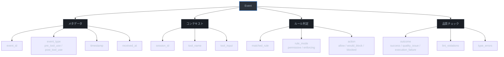

# モニタリングとログ分析

Phase 1で蓄積されるイベントログの確認方法とCloudWatch Logs Insightsクエリのリファレンス。

## イベントフロー

フックスクリプトが送信したイベントは以下の経路でCloudWatch Logsに到達し、Grafanaで可視化される。



## イベントスキーマ

CloudWatch Logs に格納される構造化JSONの全フィールドを以下に示す。



イベントJSONの構造:

```json
{
  "event_id": "evt_550e8400-e29b-41d4-a716-446655440000",
  "event_type": "pre_tool_use | post_tool_use",
  "timestamp": "2026-03-22T14:30:00Z",
  "received_at": "2026-03-22T14:30:00.123+00:00",
  "session_id": "sess_abc123",
  "tool_name": "Bash | Write | Edit | MultiEdit | Read",
  "tool_input": {
    "command": "npm test",
    "file_path": "/src/index.ts"
  },
  "matched_rule": "rule_bash_destructive_001 | null",
  "rule_mode": "permissive | enforcing | null",
  "action": "allow | would_block | blocked",
  "outcome": "success | quality_issue | execution_failure | null",
  "quality_check": {
    "lint_violations": 0,
    "type_errors": 0
  }
}
```

- `pre_tool_use` イベント: `harness-gate.sh` が送信。ルール判定結果を含む
- `post_tool_use` イベント: `harness-post.sh` が送信。品質チェック結果を含む

## AWS CLIでのログ確認

以下のコマンドでは、ロググループ名をTerraform Outputから取得する。

```bash
LOG_GROUP=$(cd /path/to/harness-cockpit/infra && terraform output -raw log_group_name)
```

### 直近のイベントを確認

```bash
aws logs filter-log-events \
  --log-group-name "${LOG_GROUP}" \
  --profile yusuke.sato \
  --region ap-northeast-1 \
  --start-time $(date -d '1 hour ago' +%s000) \
  --limit 20 \
  | jq '.events[].message | fromjson | {event_type, tool_name, action, outcome, timestamp}'
```

### 特定セッションのイベント

```bash
SESSION_ID="対象のセッションID"

aws logs filter-log-events \
  --log-group-name "${LOG_GROUP}" \
  --profile yusuke.sato \
  --region ap-northeast-1 \
  --filter-pattern "{ \$.session_id = \"${SESSION_ID}\" }" \
  | jq '.events[].message | fromjson | {timestamp, event_type, tool_name, action, outcome}'
```

### 品質問題のあったイベントのみ抽出

CloudWatch Logsのフィルタパターン構文は `||` 演算子をサポートしない。複数条件での抽出にはLogs Insightsを使用するか、条件ごとに個別のフィルタコマンドを実行する。

```bash
# outcome が quality_issue のイベント
aws logs filter-log-events \
  --log-group-name "${LOG_GROUP}" \
  --profile yusuke.sato \
  --region ap-northeast-1 \
  --filter-pattern '{ $.outcome = "quality_issue" }' \
  --start-time $(date -d '24 hours ago' +%s000) \
  | jq '.events[].message | fromjson'

# outcome が execution_failure のイベント
aws logs filter-log-events \
  --log-group-name "${LOG_GROUP}" \
  --profile yusuke.sato \
  --region ap-northeast-1 \
  --filter-pattern '{ $.outcome = "execution_failure" }' \
  --start-time $(date -d '24 hours ago' +%s000) \
  | jq '.events[].message | fromjson'
```

両方を一括取得する場合はLogs Insightsクエリを使用する:

```
fields @timestamp, event_type, tool_name, outcome,
  tool_input.command as cmd, tool_input.file_path as path
| filter outcome = "quality_issue" or outcome = "execution_failure"
| sort @timestamp desc
| limit 100
```

## CloudWatch Logs Insightsクエリ

AWSコンソールの CloudWatch > Logs Insights からクエリを実行する。ロググループは `terraform output -raw log_group_name` の値を選択。

### 基本: 直近のイベント一覧

```
fields @timestamp, event_type, tool_name, action, outcome
| sort @timestamp desc
| limit 50
```

### ツール別使用頻度

```
fields tool_name
| filter event_type = "pre_tool_use"
| stats count() as cnt by tool_name
| sort cnt desc
```

### セッションタイムライン

```
fields @timestamp, event_type, tool_name, action,
  tool_input.command as cmd, tool_input.file_path as path,
  outcome, matched_rule, rule_mode
| filter session_id = 'セッションIDをここに'
| sort @timestamp asc
```

### 品質問題の傾向分析

```
fields @timestamp, tool_name,
  tool_input.command as cmd, tool_input.file_path as path,
  outcome,
  quality_check.lint_violations as lint,
  quality_check.type_errors as types
| filter outcome != "success" and event_type = "post_tool_use"
| sort @timestamp desc
| limit 100
```

### 時間帯別イベント数

```
fields @timestamp
| filter event_type = "pre_tool_use"
| stats count() as events by bin(1h)
| sort bin asc
```

### セッション別イベント数（アクティブセッション一覧）

```
fields session_id
| filter event_type = "pre_tool_use"
| stats count() as events, min(@timestamp) as started, max(@timestamp) as ended by session_id
| sort ended desc
| limit 20
```

### would_block イベント（Phase 2以降で重要）

```
fields @timestamp, tool_name,
  tool_input.command as cmd, tool_input.file_path as path,
  matched_rule, rule_mode
| filter action = "would_block"
| sort @timestamp desc
| limit 100
```

### False Negative候補の検出

ルールにマッチしなかったが問題が発生したイベント。Phase 2でのルール作成候補となる。

```
fields @timestamp, tool_name,
  tool_input.command as cmd, tool_input.file_path as path,
  outcome
| filter action = "allow" and outcome != "success" and matched_rule = ""
| sort @timestamp desc
```

## Grafanaダッシュボード

Amazon Managed Grafanaのワークスペース、CloudWatchデータソース、Session TimelineダッシュボードはすべてTerraformで自動プロビジョニング済みである。手動でのセットアップは不要。

### アクセス方法

```bash
echo "Grafana URL: $(cd /path/to/harness-cockpit/infra && terraform output -raw grafana_endpoint)"
```

ブラウザでURLにアクセスし、IAM Identity Centerの認証を経てログインする。

### Session Timelineダッシュボード

`src/grafana/session-timeline.json` で定義され、Terraformによりデプロイ済み。以下のパネルで構成される。

| パネル | 種別 | 内容 |
|--------|------|------|
| Session Timeline | Logs | セッション内の全イベントを時系列表示 |
| Event Details | Table | イベントの詳細テーブル（action/outcomeの色分け付き） |
| Tool Usage Distribution | Pie Chart | ツール種別の使用割合 |
| Action Distribution | Pie Chart | action (allow/would_block/blocked) の割合 |

変数:
- `$datasource`: CloudWatchデータソースを選択
- `$session_id`: 表示するセッションIDを入力

色分け:
- allow: 緑
- would_block: 黄
- blocked: 赤
- quality_issue: 橙

### ダッシュボードの更新

ダッシュボードの定義を変更する場合は `src/grafana/session-timeline.json` を編集し、`terraform apply` を再実行する。Grafana UI上での手動変更はTerraformの次回適用時に上書きされるため、必ずJSONファイルを正とすること。

## Lambda関数のログ

フック処理とは別に、Lambda関数自体のログも確認できる。

| ロググループ | 内容 |
|-------------|------|
| `/aws/lambda/harness-cockpit-event-collector` | EventCollector Lambdaの実行ログ |
| `/aws/lambda/harness-cockpit-authorizer` | Authorizer Lambdaの実行ログ |
| `/aws/apigateway/harness-cockpit-api` | API Gatewayのアクセスログ |

エラー調査時はこれらのロググループも併せて確認する。

```bash
# EventCollectorのエラーログ
aws logs filter-log-events \
  --log-group-name "/aws/lambda/harness-cockpit-event-collector" \
  --profile yusuke.sato \
  --region ap-northeast-1 \
  --filter-pattern "ERROR" \
  --start-time $(date -d '1 hour ago' +%s000)
```
