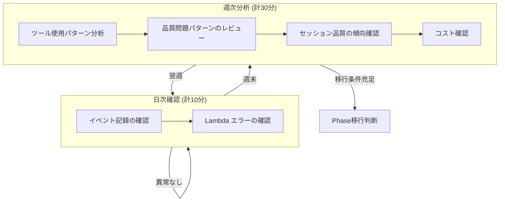
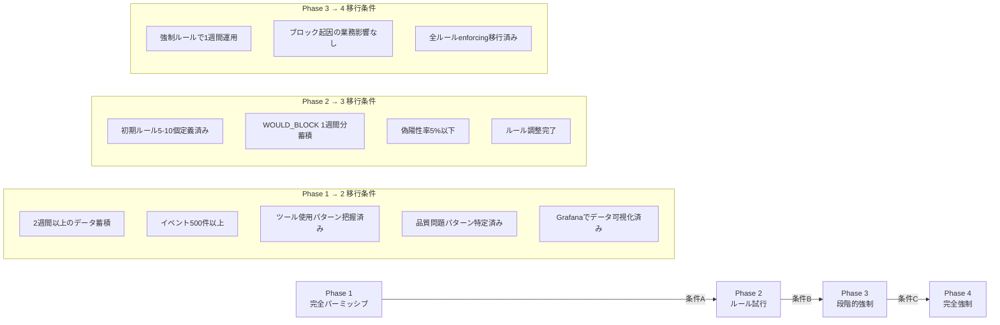

# 日常運用

Phase 1からPhase 4に至る各段階での運用作業のリファレンス。本書では日次・週次の確認項目、トークンローテーション、コスト監視、およびPhase移行判断基準を定める。

## 環境値の取得

本書のコマンド例では環境固有の値を直接記載しない。以下のコマンドで取得した値を使用すること。

```bash
cd infra/

# APIエンドポイント
ENDPOINT=$(terraform output -raw api_endpoint)

# CloudWatch Logsロググループ名
LOG_GROUP=$(terraform output -raw log_group_name)

# S3バケット名
BUCKET=$(terraform output -raw s3_bucket_name)

# Grafanaエンドポイント
GRAFANA_URL=$(terraform output -raw grafana_endpoint)
```

## 運用サイクル

Phase 1（完全パーミッシブ）の目標は2週間分の行動ベースラインデータの蓄積である。日次・週次で以下のサイクルを回す。



## 日次確認

### 直近24時間のイベント数

```bash
LOG_GROUP=$(cd infra/ && terraform output -raw log_group_name)

QUERY_ID=$(aws logs start-query \
  --log-group-name "${LOG_GROUP}" \
  --start-time $(date -d '24 hours ago' +%s) \
  --end-time $(date +%s) \
  --query-string 'stats count() as total by event_type' \
  --profile yusuke.sato \
  --region ap-northeast-1 \
  --output text --query 'queryId')

echo "Query ID: ${QUERY_ID}"
```

数秒後にクエリ結果を取得する。

```bash
aws logs get-query-results \
  --query-id "${QUERY_ID}" \
  --profile yusuke.sato \
  --region ap-northeast-1
```

イベント数が0の場合、フックが正しく動作していない可能性がある。`02-hook-installation.md` のトラブルシューティングを参照すること。

### Lambda関数のエラー確認

```bash
# EventCollector
aws logs filter-log-events \
  --log-group-name "/aws/lambda/harness-cockpit-event-collector" \
  --profile yusuke.sato \
  --region ap-northeast-1 \
  --filter-pattern "ERROR" \
  --start-time $(date -d '24 hours ago' +%s000)

# Authorizer
aws logs filter-log-events \
  --log-group-name "/aws/lambda/harness-cockpit-authorizer" \
  --profile yusuke.sato \
  --region ap-northeast-1 \
  --filter-pattern "ERROR" \
  --start-time $(date -d '24 hours ago' +%s000)
```

## 週次分析

### ツール使用頻度の確認

CloudWatch Logs Insightsで以下のクエリを実行する。

```
fields tool_name
| filter event_type = "pre_tool_use"
| stats count() as cnt by tool_name
| sort cnt desc
```

このデータはPhase 2でのルール設計の基礎データとなる。使用頻度の高いツールから優先的にルールを検討する。

### 品質問題パターンの特定

```
fields tool_name, tool_input.command as cmd, tool_input.file_path as path, outcome
| filter event_type = "post_tool_use" and outcome != "success"
| stats count() as cnt by tool_name, outcome
| sort cnt desc
```

繰り返し発生するパターンはPhase 2でのルール候補となる。

### セッション品質の傾向

```
fields session_id, outcome
| filter event_type = "post_tool_use"
| stats
    count() as total,
    sum(outcome = "success") as ok,
    sum(outcome = "quality_issue") as quality,
    sum(outcome = "execution_failure") as failure
  by session_id
| sort total desc
| limit 20
```

## APIトークンのローテーション

トークンのローテーションは以下の4段階で行う。全段階を一回の作業で完了させること。途中で中断するとフック側とサーバ側でトークンの不整合が生じる。

### 手順1: 新しいトークンの生成

```bash
NEW_TOKEN=$(uuidgen)
echo "新しいトークン: ${NEW_TOKEN}"
```

### 手順2: Terraform経由でサーバ側を更新

`infra/terraform.tfvars` の `harness_api_token` を新しいトークンに書き換える。

```hcl
harness_api_token = "<手順1で生成したトークン>"
```

Terraformを適用してSSM Parameter Storeを更新する。

```bash
cd infra/
terraform apply
```

### 手順3: Authorizer Lambdaのキャッシュクリア

Authorizer LambdaはSSM Parameter Storeのトークンをメモリにキャッシュしている。即座に新トークンを反映するため、環境変数を更新してコールドスタートを強制する。

```bash
aws lambda update-function-configuration \
  --function-name harness-cockpit-authorizer \
  --environment "Variables={TOKEN_PARAMETER_NAME=/harness/api-token,CACHE_BUST=$(date +%s)}" \
  --profile yusuke.sato \
  --region ap-northeast-1
```

### 手順4: フック側の更新と動作確認

フックをインストールした各プロジェクトの `.claude/harness-env` のトークンを更新する。

```bash
# 各プロジェクトで実行
sed -i "s/HARNESS_TOKEN=.*/HARNESS_TOKEN=${NEW_TOKEN}/" .claude/harness-env
```

動作確認として、新トークンでイベント送信をテストする。

```bash
ENDPOINT=$(cd infra/ && terraform output -raw api_endpoint)

curl -s -X POST "${ENDPOINT}/events" \
  -H "Authorization: Bearer ${NEW_TOKEN}" \
  -H "Content-Type: application/json" \
  -d '{"event_type":"pre_tool_use","session_id":"token-test","tool_name":"Bash","tool_input":{"command":"echo test"}}'
```

HTTP 200が返れば成功。401が返る場合は手順2-3を再確認すること。

## コスト監視

月額コスト見積もり（Phase 1時点）:

| サービス | 月額見込み |
|---------|----------|
| Amazon Managed Grafana (1 Editor) | $9.00 |
| CloudWatch Logs（取り込み） | ~$0.76 |
| CloudWatch Logs Insights（クエリ） | ~$0.05 |
| API Gateway HTTP API | ~$0.01 |
| Lambda | Free Tier内 |
| DynamoDB | Free Tier内 |
| S3 | ~$0.01 |
| SSM Parameter Store | Free |
| **合計** | **$10-12** |

AWS Cost Explorerでサービス別コストを確認する。

```bash
aws ce get-cost-and-usage \
  --time-period Start=$(date -d 'first day of this month' +%Y-%m-%d),End=$(date +%Y-%m-%d) \
  --granularity MONTHLY \
  --metrics BlendedCost \
  --group-by Type=DIMENSION,Key=SERVICE \
  --profile yusuke.sato
```

Grafanaダッシュボードでもコスト傾向を確認する場合は以下のURLを使用する。

```bash
echo "$(cd infra/ && terraform output -raw grafana_endpoint)"
```

## Phase移行判断基準

各Phaseの移行には以下の条件を満たす必要がある。条件は全て AND 条件である。



### Phase 1 → Phase 2

Phase 2では、蓄積データを基に初期ルールセット（5-10個）をパーミッシブモードで定義し、`WOULD_BLOCK` イベントの蓄積を開始する。

| 条件 | 確認方法 |
|------|---------|
| 2週間以上のデータ蓄積 | 最初のイベントの日付から14日以上経過 |
| イベント500件以上 | CloudWatch Logs Insightsで `stats count()` |
| ツール使用パターン把握済み | 週次分析のツール使用頻度レポートが安定 |
| 品質問題パターン特定済み | 繰り返し発生するパターンをリスト化済み |
| Grafanaでデータ可視化済み | Session Timelineダッシュボードでデータが表示される |

### Phase 2 → Phase 3

| 条件 | 確認方法 |
|------|---------|
| 初期ルール5-10個定義済み | DynamoDBのルールテーブルのレコード数 |
| WOULD_BLOCK 1週間分蓄積 | `action = "would_block"` イベントの期間 |
| 偽陽性率5%以下 | WOULD_BLOCKのうち誤検知の割合をレビュー |
| ルール調整完了 | 偽陽性を排除するルール修正が完了 |

### Phase 3 → Phase 4

| 条件 | 確認方法 |
|------|---------|
| 強制ルールで1週間運用 | enforcing開始日から7日以上経過 |
| ブロック起因の業務影響なし | ブロックされた操作が全て正当な制御 |
| 全ルールenforcing移行済み | permissiveモードのルールが0件 |
