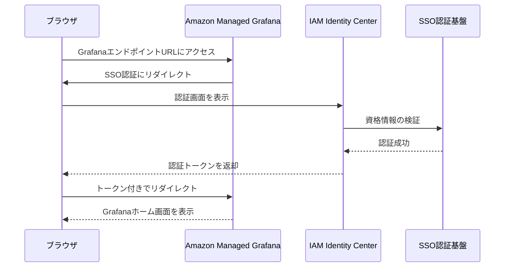
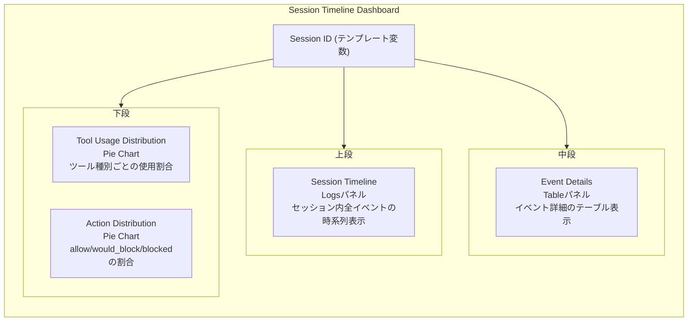

# Grafanaダッシュボード運用

Amazon Managed Grafana (AMG) のワークスペース、データソース、ダッシュボードは全てTerraformで自動プロビジョニングされる。本書ではTerraformが管理するリソースの全体像、Grafanaへのアクセス方法、ダッシュボードの使い方、および新規ダッシュボード追加の手順を記載する。

## Terraformによる自動プロビジョニング

Grafana関連の全リソースは `infra/modules/grafana/` で定義されている。手動でのコンソール操作は不要である。

| Terraformリソース | 説明 |
|------------------|------|
| `aws_grafana_workspace.harness` | AMGワークスペース本体 |
| `aws_iam_role.grafana` | Grafanaサービスロール（CloudWatch Logs読み取り権限） |
| `aws_iam_role_policy.grafana` | ロググループへのアクセスポリシー |
| `aws_grafana_role_association.admin` | SSOユーザーのAdmin権限関連付け |
| `aws_grafana_workspace_api_key.terraform` | Terraform用APIキー（ダッシュボード・データソース管理用） |
| `grafana_data_source.cloudwatch` | CloudWatchデータソース（リージョン・認証設定済み） |
| `grafana_dashboard.session_timeline` | Session Timelineダッシュボード |

ワークスペースの設定変更やダッシュボードの追加は全てTerraformコードの変更と `terraform apply` で行うこと。Grafana UIからの手動変更は `terraform apply` 時に上書きされる。

### 環境値の取得

```bash
cd infra/

# GrafanaワークスペースURL
terraform output -raw grafana_endpoint

# ロググループ名（データソースのクエリ対象）
terraform output -raw log_group_name
```

## Grafanaへのアクセス

### 認証フロー

AMGはIAM Identity Center (AWS SSO) による認証を使用する。ブラウザからアクセスすると以下のフローで認証される。



### ログイン手順

1. Grafana URLを取得する。

    ```bash
    cd infra/ && terraform output -raw grafana_endpoint
    ```

2. 取得したURLにブラウザでアクセスする。
3. 「Sign in with AWS IAM Identity Center」をクリックする。
4. IAM Identity Centerの認証画面で資格情報を入力する。
5. 認証が完了するとGrafanaのホーム画面が表示される。

初回ログイン時にAWS SSOポータル経由でリダイレクトされる場合がある。

## Session Timelineダッシュボード

Session Timelineダッシュボードは `grafana_dashboard.session_timeline` リソースとしてTerraformで管理されている。ダッシュボードJSONは `src/grafana/session-timeline.json` に格納されている。

### パネル構成



### パネル詳細

#### Session Timeline (Logsパネル)

セッション内の全イベントを時系列のログ表示で確認する。各イベントの詳細はログ行をクリックして展開する。

#### Event Details (Tableパネル)

イベントの詳細をテーブル形式で表示する。

| カラム | 説明 |
|--------|------|
| @timestamp | イベント発生時刻 |
| event_type | pre_tool_use / post_tool_use |
| tool_name | Bash / Write / Edit / MultiEdit / Read |
| action | allow / would_block / blocked |
| outcome | success / quality_issue / execution_failure |
| cmd | Bashコマンド（該当時） |
| path | ファイルパス（該当時） |
| matched_rule | マッチしたルールID |
| rule_mode | permissive / enforcing |
| lint | lint違反数 |
| types | 型エラー数 |

色分けルール:

| フィールド | 値 | 色 |
|-----------|-----|-----|
| action | allow | 緑 |
| action | would_block | 黄 |
| action | blocked | 赤 |
| outcome | success | 緑 |
| outcome | quality_issue | 橙 |
| outcome | execution_failure | 赤 |

#### Tool Usage Distribution (Pie Chart)

セッション内のツール種別ごとの使用割合を円グラフで表示する。

#### Action Distribution (Pie Chart)

セッション内のaction（allow / would_block / blocked）の割合を円グラフで表示する。Phase 1では全てallowとなる。

### セッションIDの指定

ダッシュボード上部の「Session ID」テキストボックスにセッションIDを入力して、対象セッションのデータに絞り込む。

セッションIDの一覧はGrafanaのExplore機能またはCloudWatch Logs Insightsで確認する。

```
fields session_id
| filter event_type = "pre_tool_use"
| stats count() as events, max(@timestamp) as last_seen by session_id
| sort last_seen desc
| limit 20
```

Grafana内で実行する場合: 左メニュー > Explore > データソースとして Amazon CloudWatch を選択し、上記クエリを実行する。

## 新規ダッシュボードの追加

新しいダッシュボードを追加する場合は以下の手順で行う。

### 手順1: ダッシュボードJSONの作成

`src/grafana/` ディレクトリに新しいダッシュボードのJSONファイルを配置する。

```
src/grafana/
  session-timeline.json   # 既存
  new-dashboard.json      # 新規追加
```

Grafana UIのダッシュボードエディタで作成した場合は、Settings > JSON Model からエクスポートして保存する。ただし、`id` フィールドは `null` に設定し、`uid` は一意な値に変更すること。

### 手順2: Terraformリソースの追加

`infra/modules/grafana/main.tf` に `grafana_dashboard` リソースを追加する。

```hcl
resource "grafana_dashboard" "new_dashboard" {
  config_json = file("${path.module}/../../../src/grafana/new-dashboard.json")
}
```

### 手順3: 必要に応じてoutputを追加

`infra/modules/grafana/outputs.tf` にダッシュボードURLのoutputを追加する。

```hcl
output "new_dashboard_url" {
  value = grafana_dashboard.new_dashboard.url
}
```

### 手順4: 適用

```bash
cd infra/
terraform plan   # 変更内容を確認
terraform apply  # 適用
```

## 月額コスト

| 項目 | 月額 |
|------|------|
| AMG Editor license (1ユーザー) | $9.00 |
| AMG Viewer license | $5.00/ユーザー |

現在はEditor 1名（Admin）のみの構成で、月額 $9.00。Viewer権限のユーザーを追加する場合は1ユーザーあたり $5.00 が追加される。
