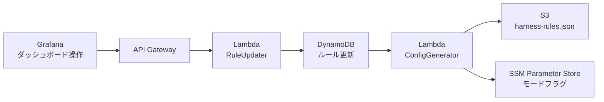
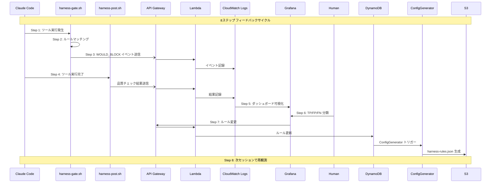
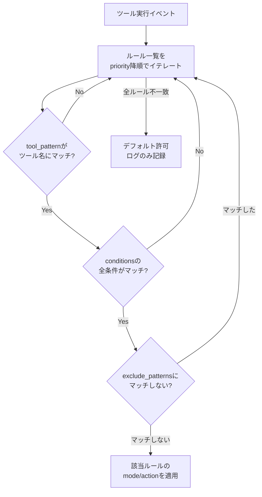
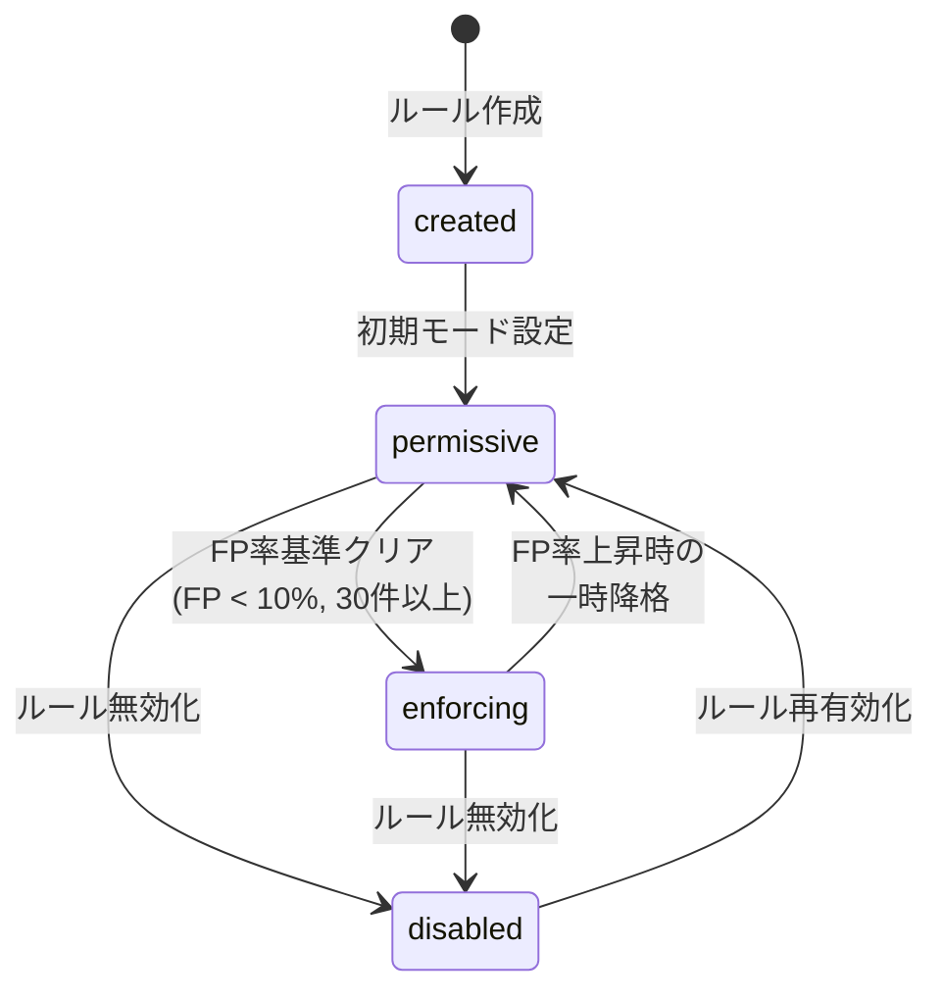
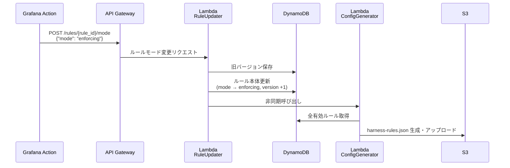
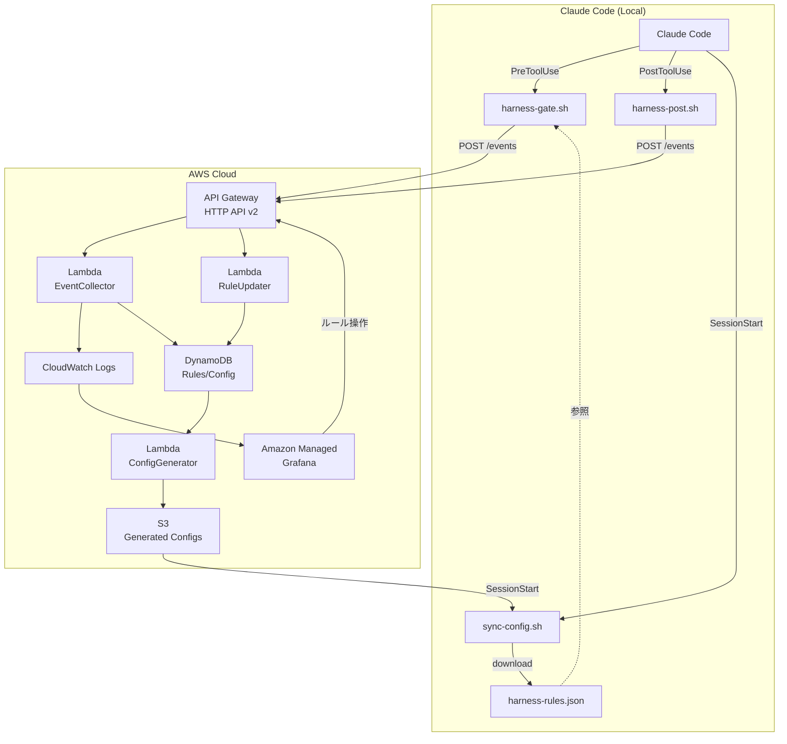
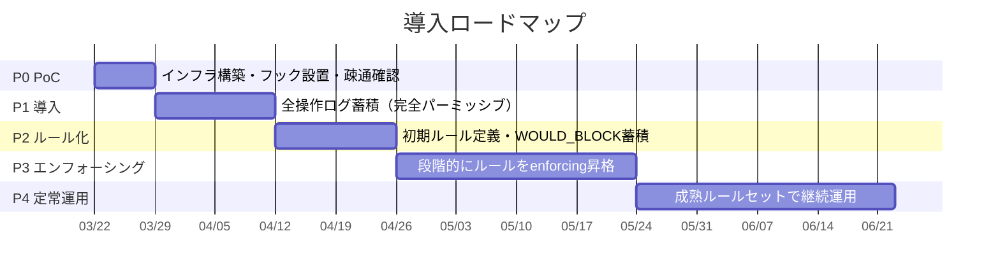

# Claude Codeハーネス制御：パーミッシブ→エンフォーシングモード設計

**Claude Code Hooksに SELinuxライクな「観測→分析→強制」サイクルを実装し、ルールを段階的にチューニングするためのAWSネイティブ設計。** 核心は、すべてのツール実行をまずブロックせずログに記録し（パーミッシブ）、ダッシュボードで誤検知パターンを分析した上で、ルール単位でエンフォーシングに昇格させるフィードバックループにある。この設計により、いきなり厳格なルールを適用して生産性を落とすリスクを排除しつつ、観測データに基づく合理的な制御強化が可能になる。月額コストは **約$10–15** で運用できる。

---

## 1. パーミッシブモードの実装アーキテクチャ

### SELinuxから借りる3つの設計原則

SELinuxのパーミッシブモードには、Claude Codeハーネスに直接移植すべき重要な設計パターンが3つある。

第一に **per-domain permissive** の概念。SELinuxはシステム全体ではなく `semanage permissive -a httpd_t` のように個別ドメイン単位でパーミッシブに設定できる。これをClaude Codeに翻訳すると、「Bashコマンド実行ルールはエンフォーシング、ファイル書き込みルールはパーミッシブ」というルール単位のモード制御になる。

第二に **audit2allow** のワークフロー。パーミッシブモードで蓄積されたAVCデニアルログから `audit2allow -M my_fix` でポリシーモジュールを自動生成し、人間がレビューして適用する。ハーネスでは、ダッシュボードの`WOULD_BLOCK`イベントから新ルールを提案し、レビュー後に `settings.json` へ反映するフローが対応する。

第三に **dontaudit文** による既知の誤検知抑制。AWS WAFの「COUNT→BLOCK」遷移でも同様に、最低1ヶ月の観測期間を推奨している。ハーネスでも、既知のfalse positiveに対する例外リスト（allowlist）を管理する。

### フック実装：ブロックせずにログだけ取る

Claude Code Hooksの `http` タイプを使い、すべてのツール実行イベントをAPI Gateway経由でLambdaに送信する。パーミッシブモードでは、Hook自体は常に **exit 0（許可）** を返しつつ、バックエンドで「もしエンフォーシングだったらブロックしていた」を記録する。

```json
{
  "hooks": {
    "PreToolUse": [
      {
        "matcher": ".*",
        "hooks": [
          {
            "type": "command",
            "command": "$CLAUDE_PROJECT_DIR/.claude/hooks/harness-gate.sh",
            "timeout": 10
          }
        ]
      }
    ],
    "PostToolUse": [
      {
        "matcher": "Write|Edit|MultiEdit|Bash",
        "hooks": [
          {
            "type": "command",
            "command": "$CLAUDE_PROJECT_DIR/.claude/hooks/harness-post.sh",
            "timeout": 30
          }
        ]
      }
    ]
  }
}
```

`harness-gate.sh`（PreToolUseフック）の設計が最も重要なコンポーネントである。このスクリプトは次の手順で動作する：

```bash
#!/usr/bin/env bash
set -euo pipefail

INPUT=$(cat)
TOOL_NAME=$(echo "$INPUT" | jq -r '.tool_name')
TOOL_INPUT=$(echo "$INPUT" | jq -c '.tool_input')
SESSION_ID=$(echo "$INPUT" | jq -r '.session_id')

# ローカルキャッシュされたルール設定を読み込む
CONFIG_FILE="$CLAUDE_PROJECT_DIR/.claude/harness-rules.json"
if [[ ! -f "$CONFIG_FILE" ]]; then
  exit 0  # 設定なし → 全許可
fi

# ルールマッチング（jqで評価）
MATCH_RESULT=$(echo "$INPUT" | jq -r --slurpfile rules "$CONFIG_FILE" '
  . as $event |
  [$rules[0].rules[] | select(.enabled == true) |
   select(.tool_pattern | test($event.tool_name)) |
   if .conditions then
     select(
       (.conditions.file_pattern == null or
        ($event.tool_input.file_path // "" | test(.conditions.file_pattern))) and
       (.conditions.command_pattern == null or
        ($event.tool_input.command // "" | test(.conditions.command_pattern)))
     )
   else . end
  ] | first // empty
')

if [[ -z "$MATCH_RESULT" ]]; then
  # ルールにマッチしない → ログのみ送信して許可
  curl -sf -X POST "$HARNESS_ENDPOINT/events" \
    -H "Authorization: Bearer $HARNESS_TOKEN" \
    -H "Content-Type: application/json" \
    -d "$(jq -n --arg sid "$SESSION_ID" --arg tool "$TOOL_NAME" \
      --argjson input "$TOOL_INPUT" \
      '{event_type:"tool_use",session_id:$sid,tool_name:$tool,
        tool_input:$input,matched_rule:null,action:"allow",
        timestamp:(now|todate)}')" &
  exit 0
fi

RULE_ID=$(echo "$MATCH_RESULT" | jq -r '.id')
RULE_MODE=$(echo "$MATCH_RESULT" | jq -r '.mode')
RULE_ACTION=$(echo "$MATCH_RESULT" | jq -r '.action')

# イベントをバックエンドに非同期送信
EVENT_ACTION="allow"
if [[ "$RULE_MODE" == "enforcing" && "$RULE_ACTION" == "deny" ]]; then
  EVENT_ACTION="blocked"
elif [[ "$RULE_MODE" == "permissive" && "$RULE_ACTION" == "deny" ]]; then
  EVENT_ACTION="would_block"
fi

curl -sf -X POST "$HARNESS_ENDPOINT/events" \
  -H "Authorization: Bearer $HARNESS_TOKEN" \
  -H "Content-Type: application/json" \
  -d "$(jq -n --arg sid "$SESSION_ID" --arg tool "$TOOL_NAME" \
    --argjson input "$TOOL_INPUT" --arg rid "$RULE_ID" \
    --arg mode "$RULE_MODE" --arg action "$EVENT_ACTION" \
    '{event_type:"pre_tool_use",session_id:$sid,tool_name:$tool,
      tool_input:$input,matched_rule:$rid,mode:$mode,
      action:$action,timestamp:(now|todate)}')" &

# モードに応じた判定
if [[ "$RULE_MODE" == "enforcing" && "$RULE_ACTION" == "deny" ]]; then
  # エンフォーシング → 実際にブロック
  jq -n '{
    hookSpecificOutput: {
      hookEventName: "PreToolUse",
      permissionDecision: "deny",
      permissionDecisionReason: "Blocked by harness rule: '"$RULE_ID"'"
    }
  }'
  exit 0
else
  # パーミッシブ or 許可ルール → 通過
  exit 0
fi
```

**設計上の重要ポイント：** `curl` はバックグラウンド実行（`&`）することで、API通信のレイテンシがClaude Codeの操作をブロックしない。ローカルの `harness-rules.json` をキャッシュとして使うことで、DynamoDBへの直接問い合わせを回避し、フック実行を **数十ミリ秒以内** に抑える。

### 設定の動的切り替え：ルール配信パイプライン

モード切り替えのデータフローは次のように設計する：



Claude Code側では、セッション開始時の `SessionStart` フックでS3から最新設定を取得する：

```json
{
  "hooks": {
    "SessionStart": [
      {
        "hooks": [
          {
            "type": "command",
            "command": "$CLAUDE_PROJECT_DIR/.claude/hooks/sync-harness-config.sh"
          }
        ]
      }
    ]
  }
}
```

ただし、**Claude Code はセッション開始時にhook設定をスナップショットする**ため、`settings.json` 自体の変更はセッション中には反映されない。これは重要な制約である。一方、フックスクリプトが参照するローカルの `harness-rules.json`（ルール定義ファイル）は動的に更新可能であり、ここにルールのモード（permissive/enforcing）と条件式を格納する。つまり、**フックの登録自体**は固定だが、**フック内のルール判定ロジック**は動的に変更できる二層構造とする。

---

## 2. フィードバックループの全体設計

### 8ステップのサイクル



フィードバックループの全体像を、データフローとともに定義する。

**ステップ1：ツール実行の発生。** Claude Codeが `Edit`、`Write`、`Bash` 等のツールを呼び出す。この時点でPreToolUseフックが発火する。

**ステップ2：PreToolUse判定。** `harness-gate.sh` がローカルの `harness-rules.json` を参照し、ルールマッチングを実行する。ツール名、ファイルパス、コマンドパターンの3軸でマッチングを行い、該当ルールのモードとアクションを取得する。

**ステップ3：パーミッシブモード記録。** マッチしたルールがパーミッシブモードの場合、`WOULD_BLOCK` イベントとしてAPI Gatewayへ送信する。ツール実行はブロックしない。CloudWatch Logsに記録されるイベントスキーマ：

```json
{
  "event_type": "pre_tool_use",
  "timestamp": "2026-03-20T14:30:00Z",
  "session_id": "sess_abc123",
  "tool_name": "Bash",
  "tool_input": {
    "command": "rm -rf ./tmp/build-cache"
  },
  "matched_rule": "rule_bash_destructive_001",
  "rule_mode": "permissive",
  "action": "would_block",
  "would_block_reason": "Matches destructive command pattern: rm -rf"
}
```

**ステップ4：PostToolUse結果記録。** ツール実行完了後、`harness-post.sh` が実行結果を記録する。Bashの場合は `exit_code`、Edit/Writeの場合はリンター実行結果（違反数、種類）を含める。

```json
{
  "event_type": "post_tool_use",
  "timestamp": "2026-03-20T14:30:02Z",
  "session_id": "sess_abc123",
  "tool_name": "Bash",
  "tool_input": {"command": "rm -rf ./tmp/build-cache"},
  "exit_code": 0,
  "outcome": "success",
  "quality_check": {
    "lint_violations": 0,
    "type_errors": 0,
    "test_failures": 0
  },
  "correlated_pre_event": "evt_pre_xyz789"
}
```

**ステップ5：ダッシュボード可視化。** Grafanaダッシュボードで以下の4象限マトリクスを表示する。これがルールチューニングの核心データとなる：

| | 実際に問題なし | 実際に問題あり |
|---|---|---|
| **WOULD_BLOCK** | **False Positive（誤検知）** — ルール緩和検討 | **True Positive** — エンフォーシング昇格候補 |
| **WOULD_ALLOW** | **True Negative** — 正常動作 | **False Negative（見逃し）** — 新ルール作成候補 |

「問題あり」の判定は、PostToolUseの `outcome` フィールド（`exit_code != 0`、リンター違反発生、テスト失敗）と、人間によるインシデントレビューの両方から導出する。

**ステップ6：人間によるルール調整。** ダッシュボードのインシデントレビュービューで、各 `WOULD_BLOCK` イベントを「正しいブロック判定（Confirm）」「誤検知（False Positive）」「判断保留（Defer）」に分類する。この分類データがルールのFP率/TP率を更新する。

**ステップ7：settings.json再生成。** ルール変更がDynamoDBにコミットされると、Lambda（ConfigGenerator）が発火し、新しい `harness-rules.json` をS3に生成する。Claude Code側の `sync-harness-config.sh` が定期的に（または次回セッション開始時に）この設定をpullする。

**ステップ8：再観測。** 新しいルールセットで次のセッションが開始され、サイクルが繰り返される。

### 「問題あり」の自動検出ロジック

PostToolUseフックで問題を自動検出するロジックは、Nyosegawaのハーネスエンジニアリングベストプラクティスで提唱される「Quality Loops」パターンに基づく。Edit/Writeの後にリンターとタイプチェッカーを実行し、その結果をフィードバックとして記録する：

```bash
#!/usr/bin/env bash
# harness-post.sh — PostToolUse Hook
set -euo pipefail

INPUT=$(cat)
TOOL_NAME=$(echo "$INPUT" | jq -r '.tool_name')
FILE_PATH=$(echo "$INPUT" | jq -r '.tool_input.file_path // empty')
SESSION_ID=$(echo "$INPUT" | jq -r '.session_id')

LINT_VIOLATIONS=0
TYPE_ERRORS=0
OUTCOME="success"

# ファイル編集系ツールの場合、品質チェックを実行
if [[ "$TOOL_NAME" =~ ^(Write|Edit|MultiEdit)$ ]] && [[ -n "$FILE_PATH" ]]; then
  # Biome/Oxlintによる高速リント（50-100x faster than ESLint）
  if command -v biome &>/dev/null; then
    LINT_OUTPUT=$(biome check "$FILE_PATH" 2>&1 || true)
    LINT_VIOLATIONS=$(echo "$LINT_OUTPUT" | grep -c "error\|warning" || true)
  fi

  # TypeScript型チェック
  if [[ "$FILE_PATH" == *.ts || "$FILE_PATH" == *.tsx ]]; then
    TYPE_OUTPUT=$(npx tsc --noEmit "$FILE_PATH" 2>&1 || true)
    TYPE_ERRORS=$(echo "$TYPE_OUTPUT" | grep -c "error TS" || true)
  fi

  if [[ $LINT_VIOLATIONS -gt 0 || $TYPE_ERRORS -gt 0 ]]; then
    OUTCOME="quality_issue"
  fi
fi

# Bashの場合、exit_codeで判定
if [[ "$TOOL_NAME" == "Bash" ]]; then
  EXIT_CODE=$(echo "$INPUT" | jq -r '.tool_response.exit_code // 0')
  if [[ "$EXIT_CODE" != "0" ]]; then
    OUTCOME="execution_failure"
  fi
fi

# イベント送信
curl -sf -X POST "$HARNESS_ENDPOINT/events" \
  -H "Authorization: Bearer $HARNESS_TOKEN" \
  -H "Content-Type: application/json" \
  -d "$(jq -n --arg sid "$SESSION_ID" --arg tool "$TOOL_NAME" \
    --arg outcome "$OUTCOME" --argjson lint "$LINT_VIOLATIONS" \
    --argjson types "$TYPE_ERRORS" \
    '{event_type:"post_tool_use",session_id:$sid,tool_name:$tool,
      outcome:$outcome,quality_check:{lint_violations:$lint,type_errors:$types},
      timestamp:(now|todate)}')" &

exit 0
```

> **実装注記：** 上記コードは設計時点の参考実装である。実際の実装ではプラグインディレクトリ方式を採用し、`.claude/harness-checks/` 内のスクリプトを動的に検出・実行する。これにより biome/tsc 以外の任意のツール（RuboCop, Ruff, mypy 等）にも対応可能となった。詳細は `src/hooks/harness-post.sh` および `examples/` を参照。

---

## 3. ルール管理システムの設計

### ルールのデータモデル

DynamoDBに格納するルールエンティティの完全なスキーマを以下に定義する。各ルールは「どのツールの」「どのパターンに」「どのモードで」「何をするか」を宣言的に記述する。

```json
{
  "PK": "PROJECT#my-project",
  "SK": "RULE#rule_bash_destructive_001",
  "entity_type": "Rule",
  "id": "rule_bash_destructive_001",
  "name": "破壊的Bashコマンドの検出",
  "description": "rm -rf, drop table 等の破壊的コマンドをブロック",
  "version": 3,
  "enabled": true,
  "mode": "permissive",
  "action": "deny",
  "priority": 100,
  "tool_pattern": "Bash",
  "conditions": {
    "command_pattern": "(rm\\s+-rf|drop\\s+table|truncate\\s+table|format\\s+)",
    "file_pattern": null,
    "content_pattern": null,
    "exclude_patterns": ["rm -rf ./node_modules", "rm -rf ./dist", "rm -rf ./.cache"]
  },
  "stats": {
    "total_matches": 47,
    "true_positives": 12,
    "false_positives": 30,
    "unreviewed": 5,
    "fp_rate": 0.638,
    "last_matched": "2026-03-19T10:23:00Z"
  },
  "metadata": {
    "created_at": "2026-03-01T00:00:00Z",
    "created_by": "manual",
    "updated_at": "2026-03-18T14:00:00Z",
    "source": "audit2allow",
    "tags": ["security", "bash", "destructive"]
  }
}
```

### DynamoDB単一テーブル設計

```
PK                          SK                                用途
─────────────────────────────────────────────────────────────────
PROJECT#proj-1              RULE#rule_001                     ルール定義
PROJECT#proj-1              RULE#rule_001#V#00003             ルールバージョン
PROJECT#proj-1              CONFIG#current                    現在のsettings.json
PROJECT#proj-1              CONFIG#V#00015                    設定バージョン
EVENT#2026-03-20            SESSION#sess_abc#TS#14:30:00      イベント記録

GSI1:
GSI1PK                      GSI1SK                           用途
─────────────────────────────────────────────────────────────────
MODE#permissive             PROJECT#proj-1#RULE#rule_001     モード別ルール一覧
MODE#enforcing              PROJECT#proj-1#RULE#rule_003     モード別ルール一覧
RULE#rule_001               EVENT#2026-03-20T14:30:00        ルール別イベント
```

**ルールバージョン管理：** ルール更新時に現在のルールを `RULE#rule_001#V#00003` のSKで保存し、本体の `RULE#rule_001` を新バージョンで上書きする。ロールバックは旧バージョンアイテムの読み取りと本体への書き戻しで実現する。DynamoDBの条件付き書き込み（`ConditionExpression`）で楽観的ロックを適用し、競合を防ぐ。

### 判定ロジックの評価順序

ルールの評価は以下の優先順位で行う。SELinuxのポリシー評価と同様、**最も具体的なルールが優先**される原則：

1. **priority値**の降順（数値が大きいほど高優先）
2. 同一priorityの場合、**条件式の具体性**（条件数が多いほど高優先）
3. 同一具体性の場合、**最後に更新された**ルールが優先





### False Positive / False Negativeの追跡

各イベントには `review_status` フィールドを持たせ、ダッシュボードから人間が分類する：

- **`unreviewed`** — 初期状態
- **`confirmed_tp`** — True Positive：正しくブロック判定された
- **`confirmed_fp`** — False Positive：誤検知、ルール緩和が必要
- **`confirmed_fn`** — False Negative：見逃し、新ルール追加が必要
- **`confirmed_tn`** — True Negative：正しく許可された

レビュー結果はDynamoDBのイベントレコードに書き戻すと同時に、対応するルールの `stats` を更新する。**FP率が50%を超えたルールはダッシュボードで赤色警告**を表示し、ルール条件の見直しを促す。

---

## 4. ダッシュボードのコックピット設計

Amazon Managed Grafana（AMG）で4つのビューを構築する。データソースはCloudWatch Logs（イベントデータ）とLambdaバックエンド経由のDynamoDB（ルール・設定データ）の2系統。Grafana 11.6以降の **Visualization Actions** 機能を活用し、テーブルセルからAPI Gatewayを直接呼び出すことでルール操作を実現する。

### ルール管理ビュー（Rule Cockpit）

このビューがシステムの「操縦席」であり、最も重要なダッシュボードパネルとなる。

**メインテーブルパネル：** CloudWatch Logs InsightsとDynamoDBの結合データを表示する。

| ルールID | 名前 | モード | FP率 | マッチ数(24h) | 最終マッチ | アクション |
|---|---|---|---|---|---|---|
| rule_001 | 破壊的Bash | permissive | **63.8%** | 12 | 3時間前 | [Enforce] [Edit] [Disable] |
| rule_002 | .env保護 | enforcing | 2.1% | 3 | 1日前 | [Permissive] [Edit] [Disable] |
| rule_003 | 本番DB接続 | enforcing | 0% | 0 | -- | [Permissive] [Edit] [Disable] |

**アクションボタンの実装：** Grafana Visualization Actionsを使い、テーブルの各行に操作ボタンを配置する。`[Enforce]` ボタンクリック時のフロー：



**サブパネル群：**
- **モード分布ゲージ：** 全ルール中のpermissive/enforcing/disabled比率（円グラフ）
- **FP率トレンド：** 各ルールのFP率の時系列推移（折れ線グラフ）。ルール変更時点に垂直アノテーション
- **推奨アクション：** FP率が閾値を超えたルールの自動推奨（「rule_001のexclude_patternsに `rm -rf ./node_modules` を追加推奨」）

### インシデントレビュービュー（Incident Review）

`WOULD_BLOCK`イベントの一覧をレビューし、TP/FP/FN分類を行うための作業画面。

**CloudWatch Logs Insightsクエリ（メインパネル）：**
```
fields @timestamp, session_id, tool_name,
  tool_input.command as command,
  tool_input.file_path as file_path,
  matched_rule, action, rule_mode
| filter action = "would_block"
| sort @timestamp desc
| limit 100
```

**レイアウト：** テーブル形式で表示し、各行に分類ボタンを配置。

| 時刻 | ツール | 対象 | ルール | 結果 | 分類 |
|---|---|---|---|---|---|
| 14:30 | Bash | `rm -rf ./tmp/cache` | rule_001 | 成功 | [TP] [**FP**] [Defer] |
| 14:28 | Write | `src/config.ts` | rule_005 | lint違反2件 | [**TP**] [FP] [Defer] |

分類ボタンのクリックで、Lambda経由でイベントの `review_status` とルールの `stats` を同時に更新する。

**False Negative検出パネル：** 「ルールにマッチしなかったが `outcome` が `quality_issue` や `execution_failure` だったイベント」を自動抽出する：

```
fields @timestamp, tool_name, tool_input.command, outcome
| filter action = "allow" and outcome != "success" and matched_rule = null
| sort @timestamp desc
```

これらは新ルール作成の候補として表示される。

### 品質トレンドビュー（Quality Trends）

**セッション品質スコアの算出：** 各セッションに対して、以下の加重スコアを計算する。

```
品質スコア = 100 - (lint_violations * 2) - (type_errors * 5)
             - (test_failures * 10) - (execution_failures * 3)
```

**パネル構成：**
- **品質スコア推移（時系列）：** セッション単位の品質スコアを折れ線グラフで表示。ルール変更のタイミングを垂直アノテーションで重ね、相関を可視化
- **ルール変更インパクト（散布図）：** 横軸にルール変更日、縦軸に変更後1週間のFP率変化
- **ツール別問題発生率（棒グラフ）：** Bash/Write/Edit別の `outcome != success` 率

### セッションログビュー（Session Timeline）

セッション変数 `$session_id` でフィルタリングし、単一セッションの全操作をタイムライン表示する。

```
fields @timestamp, event_type, tool_name, action,
  tool_input.command as cmd, tool_input.file_path as path,
  outcome, matched_rule
| filter session_id = '$session_id'
| sort @timestamp asc
```

Grafanaの **Logs パネル** を使い、各イベントを色分け表示する：
- **allow（問題なし）** — 緑
- **would_block** — 黄
- **blocked** — 赤
- **quality_issue** — オレンジ

---

## 5. AWSネイティブ実装の全体構成

### アーキテクチャ概要図



### API Gateway + Lambda：イベント受信

**API Gateway（HTTP API v2）** を使用する。REST API v1より低コスト（**$1.00/100万リクエスト**）で、Lambda統合もシンプルである。

```yaml
# SAM template (抜粋)
AWSTemplateFormatVersion: '2010-09-09'
Transform: AWS::Serverless-2016-10-31

Resources:
  HarnessApi:
    Type: AWS::Serverless::HttpApi
    Properties:
      StageName: v1
      Auth:
        DefaultAuthorizer: BearerAuth
        Authorizers:
          BearerAuth:
            AuthorizationScopes: []
            IdentitySource: $request.header.Authorization
            JwtConfiguration:
              issuer: !Sub "https://cognito-idp.${AWS::Region}.amazonaws.com/${UserPool}"
              audience:
                - !Ref UserPoolClient

  EventCollector:
    Type: AWS::Serverless::Function
    Properties:
      Handler: event_collector.handler
      Runtime: python3.12
      MemorySize: 256
      Timeout: 10
      Events:
        PostEvent:
          Type: HttpApi
          Properties:
            ApiId: !Ref HarnessApi
            Path: /events
            Method: POST
      Environment:
        Variables:
          LOG_GROUP: !Ref HarnessLogGroup
          RULES_TABLE: !Ref RulesTable
      Policies:
        - CloudWatchLogsFullAccess
        - DynamoDBCrudPolicy:
            TableName: !Ref RulesTable
```

**Lambda関数（EventCollector）** のコア実装：

```python
import json, boto3, uuid
from datetime import datetime

logs_client = boto3.client('logs')
LOG_GROUP = '/harness/claude-code/events'

def handler(event, context):
    body = json.loads(event['body'])

    # イベントIDの付与
    body['event_id'] = str(uuid.uuid4())
    body['received_at'] = datetime.utcnow().isoformat() + 'Z'

    # CloudWatch Logsへ構造化JSONとして送信
    log_stream = f"{body.get('session_id', 'unknown')}/{datetime.utcnow().strftime('%Y-%m-%d')}"

    try:
        logs_client.put_log_events(
            logGroupName=LOG_GROUP,
            logStreamName=log_stream,
            logEvents=[{
                'timestamp': int(datetime.utcnow().timestamp() * 1000),
                'message': json.dumps(body, ensure_ascii=False)
            }]
        )
    except logs_client.exceptions.ResourceNotFoundException:
        logs_client.create_log_stream(logGroupName=LOG_GROUP, logStreamName=log_stream)
        logs_client.put_log_events(
            logGroupName=LOG_GROUP,
            logStreamName=log_stream,
            logEvents=[{
                'timestamp': int(datetime.utcnow().timestamp() * 1000),
                'message': json.dumps(body, ensure_ascii=False)
            }]
        )

    return {'statusCode': 200, 'body': json.dumps({'event_id': body['event_id']})}
```

### CloudWatch Logsのイベントスキーマ

ロググループ `/harness/claude-code/events` に以下のスキーマで構造化JSONを格納する。CloudWatch Logs Insightsが自動的にJSONフィールドを認識し、クエリ可能にする。

```json
{
  "event_id": "evt_550e8400-e29b-41d4-a716-446655440000",
  "event_type": "pre_tool_use | post_tool_use | session_start | session_end",
  "timestamp": "2026-03-20T14:30:00Z",
  "received_at": "2026-03-20T14:30:00.123Z",
  "session_id": "sess_abc123",
  "project_id": "my-project",
  "tool_name": "Bash | Write | Edit | MultiEdit | Read",
  "tool_input": {
    "command": "npm test",
    "file_path": "/src/index.ts",
    "content": "(truncated)"
  },
  "matched_rule": "rule_bash_destructive_001 | null",
  "rule_mode": "permissive | enforcing | null",
  "action": "allow | would_block | blocked",
  "would_block_reason": "Matches destructive command pattern",
  "outcome": "success | quality_issue | execution_failure | null",
  "quality_check": {
    "lint_violations": 0,
    "type_errors": 0,
    "test_failures": 0
  },
  "review_status": "unreviewed | confirmed_tp | confirmed_fp | confirmed_fn",
  "correlation_id": "evt_pre_xyz789"
}
```

**ログ保持期間：** 90日間（CloudWatch Logsの保持ポリシーで設定）。長期分析にはS3エクスポートも検討するが、90日で十分。

### DynamoDB + Lambda：ルール設定管理

**RuleUpdater Lambda** はGrafanaダッシュボードのアクションボタンから呼び出され、ルールのCRUDとモード切り替えを処理する：

```python
def update_rule_mode(rule_id, new_mode, project_id):
    table = boto3.resource('dynamodb').Table('HarnessRules')

    # 現在のルールを取得
    current = table.get_item(
        Key={'PK': f'PROJECT#{project_id}', 'SK': f'RULE#{rule_id}'}
    )['Item']

    # 旧バージョンを保存（ロールバック用）
    old_version = current['version']
    table.put_item(Item={
        **current,
        'SK': f"RULE#{rule_id}#V#{old_version:05d}"
    })

    # ルール本体を更新
    table.update_item(
        Key={'PK': f'PROJECT#{project_id}', 'SK': f'RULE#{rule_id}'},
        UpdateExpression='SET #mode = :mode, version = version + :inc, updated_at = :now',
        ExpressionAttributeNames={'#mode': 'mode'},
        ExpressionAttributeValues={
            ':mode': new_mode,
            ':inc': 1,
            ':now': datetime.utcnow().isoformat() + 'Z'
        },
        ConditionExpression='version = :expected_version',
        ExpressionAttributeValues={':expected_version': old_version}
    )

    # ConfigGenerator Lambda を非同期呼び出し
    boto3.client('lambda').invoke(
        FunctionName='ConfigGenerator',
        InvocationType='Event',
        Payload=json.dumps({'project_id': project_id})
    )
```

### S3 + SSMによる設定配信

**ConfigGenerator Lambda** がDynamoDBの全ルールを読み取り、Claude Codeが消費する `harness-rules.json` を生成してS3にアップロードする：

```python
def generate_config(project_id):
    table = boto3.resource('dynamodb').Table('HarnessRules')

    # 全有効ルールを取得
    response = table.query(
        KeyConditionExpression=Key('PK').eq(f'PROJECT#{project_id}')
                              & Key('SK').begins_with('RULE#'),
        FilterExpression=Attr('entity_type').eq('Rule') & Attr('enabled').eq(True)
    )

    rules = sorted(response['Items'], key=lambda r: r.get('priority', 0), reverse=True)

    # harness-rules.json生成
    harness_config = {
        "version": int(datetime.utcnow().timestamp()),
        "generated_at": datetime.utcnow().isoformat() + 'Z',
        "project_id": project_id,
        "rules": [{
            "id": r['id'],
            "name": r['name'],
            "enabled": r['enabled'],
            "mode": r['mode'],
            "action": r['action'],
            "priority": r.get('priority', 0),
            "tool_pattern": r['tool_pattern'],
            "conditions": r.get('conditions', {}),
        } for r in rules]
    }

    # S3アップロード（バージョニング有効）
    s3 = boto3.client('s3')
    s3.put_object(
        Bucket='harness-configs',
        Key=f'{project_id}/harness-rules.json',
        Body=json.dumps(harness_config, indent=2, ensure_ascii=False),
        ContentType='application/json'
    )

    # SSM Parameter Storeにモードフラグ更新
    ssm = boto3.client('ssm')
    enforcing_count = sum(1 for r in rules if r['mode'] == 'enforcing')
    ssm.put_parameter(
        Name=f'/harness/{project_id}/enforcing-count',
        Value=str(enforcing_count),
        Type='String',
        Overwrite=True
    )
```

**Claude Code側のsync-config.sh：**
```bash
#!/usr/bin/env bash
# SessionStart Hookで実行
aws s3 cp "s3://harness-configs/${PROJECT_ID}/harness-rules.json" \
  "$CLAUDE_PROJECT_DIR/.claude/harness-rules.json" --quiet 2>/dev/null || true
```

### Amazon Managed Grafana設定

AMGのCloudWatch Logsデータソースは自動検出される。IAMロールに `logs:StartQuery`、`logs:GetQueryResults` 権限を付与すれば、Grafanaパネル内でCloudWatch Logs Insightsクエリを直接実行できる。

DynamoDBデータの表示には、**Lambda経由のJSON APIデータソース**（Grafana Infinity プラグイン）を使用する。Lambda関数がDynamoDBからルール一覧を返すAPIを公開し、GrafanaのInfinityデータソースがこのAPIを定期的にポーリングする。

**月額コスト見積もり：**

| サービス | 月額 |
|---|---|
| Amazon Managed Grafana（1 Editor） | $9.00 |
| CloudWatch Logs（取り込み1GB想定） | $0.76 |
| CloudWatch Logs Insights（クエリ） | ~$0.05 |
| API Gateway HTTP API | ~$0.01 |
| Lambda | Free Tier内 |
| DynamoDB | Free Tier内（25GB, 25 WCU/RCU） |
| S3 | ~$0.01 |
| SSM Parameter Store（Standard） | Free |
| **合計** | **約$10--12/月** |

---

## 6. 段階的導入ロードマップ



### P0: PoC（1--2週間）

**目標：** インフラ構築、フック設置、E2E疎通確認までを完了する。

**タスク：**
1. Terraformで全AWSリソースをデプロイ（API Gateway、Lambda、CloudWatch Logs、DynamoDB、S3、AMG）
2. `scripts/install-hooks.sh` で対象プロジェクトにフックを設置
3. テストイベント送信とCloudWatch Logsへの記録を確認
4. Grafana Session Timelineダッシュボードでイベント表示を確認

**成果物：** デプロイ済みインフラ、動作するフック、Grafanaダッシュボード。

### P1: 導入（1--2週間）

**目標：** 全操作をログに記録し、行動ベースラインデータを蓄積する。ブロックは一切行わない。

**タスク：**
1. 日常のClaude Code利用でイベントを蓄積（ルールファイルなし＝全許可モード）
2. 日次でイベント記録の確認、Lambdaエラーの確認
3. 週次でツール使用パターンと品質問題パターンを分析

**成果物：** ツール実行ログの行動ベースライン。SELinuxで `setenforce 0` にして `audit.log` を蓄積するフェーズに相当する。

### P2: ルール化（1--2週間）

**目標：** 蓄積ログを分析し、パーミッシブモードのルールを定義する。

**タスク：**
1. P1のログデータをCloudWatch Logs Insightsで分析し、頻出パターンを特定
2. 初期ルールセット（5--10個）をDynamoDBに登録。**全ルールをパーミッシブモードで開始**
3. ルール管理ビューとインシデントレビュービューをGrafanaに構築
4. `WOULD_BLOCK`イベントの蓄積を開始

**初期ルール例：**
- `rule_bash_destructive`：`rm -rf`、`drop table` 等 → permissive/deny
- `rule_env_protection`：`.env`、`.secrets` への書き込み → permissive/deny
- `rule_config_protection`：`tsconfig.json`、`biome.json` の編集 → permissive/deny
- `rule_git_operations`：`git push` with force flag、`git reset --hard` → permissive/deny
- `rule_production_access`：本番環境への接続コマンド → permissive/deny

**成果物：** `WOULD_BLOCK` イベントのレビューデータ。各ルールのFP率が可視化され始める。

### P3: エンフォーシング（2--4週間）

**目標：** FP率が十分に低い（**10%未満**）ルールをエンフォーシングに昇格する。

**昇格基準（audit2allowの人間レビューに相当）：**
- `WOULD_BLOCK`イベントが **30件以上** 蓄積されている
- FP率が **10%未満**
- 直近1週間にFPが **0件**
- ルール作成から **2週間以上** 経過

**典型的な昇格候補：** `.env`保護ルール（FP率は通常ほぼ0%）、本番DB接続ルール。一方、`rm -rf`ルールは `./node_modules` 等の正当なユースケースが多くFP率が高いため、`exclude_patterns` の追加調整を繰り返してから昇格する。

**Grafanaアクション：** ルール管理ビューの`[Enforce]`ボタンでルール単位のモード切替。品質トレンドビューでエンフォーシング前後の品質スコア変化を監視する。

### P4: 定常運用

**目標：** 成熟したルールセットで大半の操作を制御下に置く。新ルール追加時のみパーミッシブで開始するサイクルを確立する。

**運用サイクル：**
1. 新しい問題パターンを発見 → パーミッシブモードで新ルール追加
2. 1--2週間の観測期間
3. FP率が基準を満たしたらエンフォーシング昇格
4. 既存ルールでFP率が上昇したら一時的にパーミッシブに降格して調査

**自動化の追加（このフェーズで検討）：**
- FP率が閾値を超えたルールを自動でパーミッシブに降格するGrafanaアラート
- `WOULD_BLOCK`イベントの傾向から新ルールを自動提案するLambda（audit2allow的機能）

---

## まとめ：設計の核心的洞察

この設計の最大の価値は、**ルールの品質が観測データによって客観的に測定される**点にある。FP率という単一指標がルールの成熟度を示し、パーミッシブ→エンフォーシングの昇格判断を定量的に行える。SELinuxの `audit2allow` が「ログからポリシーを生成する」のと同様に、このシステムは「ログからルールの妥当性を検証する」。

Nyosegawaの「プロンプトではなく仕組みで品質を担保する」原則と、SELinuxの「観測→分析→強制」サイクルを組み合わせることで、安全かつ生産性を犠牲にしないAIコーディング環境を段階的に構築できる。月額$10--12のAWSコストで、エンタープライズグレードのハーネス制御システムが実現する。

重要な設計上の制約として、**Claude Codeはセッション開始時にhook設定をスナップショットする**ため、`settings.json` のフック登録自体はセッション中に変更できない。この制約を「フック登録は固定、フック内のルール判定ロジック（`harness-rules.json`）は動的」という二層設計で回避している点が、本設計のアーキテクチャ上の鍵である。
